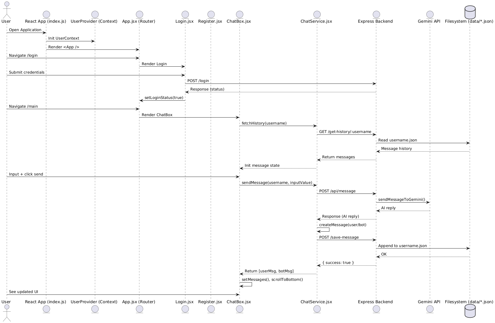

# speech-to-text

To start, we need to create `.env` file as follow:
GEMINI_API_KEY=<OUR-API-KEY-HERE>

Backend server need `index.js` to create API endpoint.
gemini.js is for interacting with gemini API

How to run: **npm run dev** . This command will run both backend and frontend.

Dependency: (just run `npm install` in parent directory)

--------------------------------------------------------------------
# 🧠 Speech-to-Text AI Chat App

> Chat ứng dụng AI siêu mượt, hỗ trợ nhập giọng nói, phản hồi thông minh, và lưu lịch sử theo user. Được build bằng React + Node.js + OpenAI Gemini (có thể tuỳ biến).

---

## 🚀 Tính năng chính

- 🎙️ **Ghi âm giọng nói** và chuyển sang văn bản (STT)
- 💬 **Chat AI** với phản hồi thông minh (sử dụng Gemini API hoặc mô hình tuỳ chọn)
- 📁 **Lưu lịch sử hội thoại** theo từng user (`username.json`)
- 🔐 **Đăng nhập / Đăng ký** với context lưu username
- 📦 Code tách riêng rõ ràng: UI, hook, service, backend

---

## 🧪 Cài đặt & Chạy thử

### 1. Cài dependencies

```bash
cd <to base>
npm install .
```
### 2. Chạy server và frontend
# Terminal
```npm run dev```

## 🧠 Refactor & Design Highlights

### 🧩 Tách logic ra hooks & services
- Phần xử lý STT (speech-to-text) được chuyển sang `hooks/useSpeechToText.js`
- Gửi & nhận tin nhắn qua `services/ChatService.jsx`
- Gọn code, dễ bảo trì, dễ test, scale lên chức năng mới cũng đơn giản hơn.

### 💡 Auto-scroll khi có tin nhắn mới
- Sử dụng `useRef` + `scrollTo` trong `Chatbox.jsx`
- UX mượt như nhung, không cần kéo tay.

### 🧼 Clean code chuẩn dev
- Dùng `async/await`, xử lý lỗi rõ ràng.
- Tránh callback hell, tránh setState loạn.
- Kiểm tra input, tránh gửi tin nhắn rỗng.

### ⚙️ Mở rộng dễ như ăn bánh
- Có thể thêm:
  - Voice-to-voice: ghép luôn TTS đầu ra
  - Upload file / ảnh đính kèm
  - Đổi nhân vật AI, cài sẵn prompt role
  - Theme tuỳ biến hoặc Dark Mode auto

---

## 🧔 Devs nên biết

- Code theo tư duy **modular**, chia rõ components / logic / data.
- Hooks tự viết được, tái sử dụng dễ.
- UI component tách riêng:
  - `ChatMessage`: hiển thị 1 message
  - `ChatInput`: xử lý input và nút voice


UML Raw, xem detailed tại www.planttext.com
@startuml

actor User
entity "React App (index.js)" as ReactApp
entity "UserProvider (Context)" as Context
entity "App.jsx (Router)" as AppRouter
entity "Login.jsx" as Login
entity "Register.jsx" as Register
entity "ChatBox.jsx" as ChatBox
entity "ChatService.jsx" as ChatService
entity "Express Backend" as Backend
entity "Gemini API" as AI
database "Filesystem (data/*.json)" as FS

User -> ReactApp : Open Application
ReactApp -> Context : Init UserContext
ReactApp -> AppRouter : Render <App />

User -> AppRouter : Navigate /login
AppRouter -> Login : Render Login
User -> Login : Submit credentials
Login -> Backend : POST /login
Backend --> Login : Response (status)
Login -> AppRouter : setLoginStatus(true)

User -> AppRouter : Navigate /main
AppRouter -> ChatBox : Render ChatBox
ChatBox -> ChatService : fetchHistory(username)
ChatService -> Backend : GET /get-history/:username
Backend -> FS : Read username.json
FS --> Backend : Message history
Backend --> ChatService : Return messages
ChatService --> ChatBox : Init message state

User -> ChatBox : Input + click send
ChatBox -> ChatService : sendMessage(username, inputValue)
ChatService -> Backend : POST /api/message
Backend -> AI : sendMessageToGemini()
AI --> Backend : AI reply
Backend --> ChatService : Response (AI reply)
ChatService -> ChatService : createMessage(user/bot)
ChatService -> Backend : POST /save-message
Backend -> FS : Append to username.json
FS --> Backend : OK
Backend --> ChatService : { success: true }
ChatService --> ChatBox : Return [userMsg, botMsg]
ChatBox -> ChatBox : setMessages(), scrollToBottom()

User -> ChatBox : See updated UI

@enduml

