# speech-to-text

To start, we need to create `.env` file as follow:
GEMINI_API_KEY=<OUR-API-KEY-HERE>

Backend server need `index.js` to create API endpoint.
gemini.js is for interacting with gemini API

How to run: **npm run dev** . This command will run both backend and frontend.

Dependency: (just run `npm install` in parent directory)

--------------------------------------------------------------------
# 🧠 Speech-to-Text AI Chat App

> Chat ứng dụng AI siêu mượt, hỗ trợ nhập giọng nói, phản hồi thông minh, và lưu lịch sử theo user. Được build bằng React + Node.js + OpenAI Gemini (có thể tuỳ biến).

---

## 🚀 Tính năng chính

- 🎙️ **Ghi âm giọng nói** và chuyển sang văn bản (STT)
- 💬 **Chat AI** với phản hồi thông minh (sử dụng Gemini API hoặc mô hình tuỳ chọn)
- 📁 **Lưu lịch sử hội thoại** theo từng user (`username.json`)
- 🔐 **Đăng nhập / Đăng ký** với context lưu username
- 📦 Code tách riêng rõ ràng: UI, hook, service, backend

---

## 🧪 Cài đặt & Chạy thử

### 1. Cài dependencies

```bash
cd <to base>
npm install .
```
### 2. Chạy server và frontend
# Terminal
```npm run dev```

## 🧠 Refactor & Design Highlights

### 🧩 Tách logic ra hooks & services
- Phần xử lý STT (speech-to-text) được chuyển sang `hooks/useSpeechToText.js`
- Gửi & nhận tin nhắn qua `services/ChatService.jsx`
- Gọn code, dễ bảo trì, dễ test, scale lên chức năng mới cũng đơn giản hơn.

### 💡 Auto-scroll khi có tin nhắn mới
- Sử dụng `useRef` + `scrollTo` trong `Chatbox.jsx`
- UX mượt như nhung, không cần kéo tay.

### 🧼 Clean code
- Dùng `async/await`, xử lý lỗi rõ ràng.
- Tránh callback hell, tránh setState loạn.
- Kiểm tra input, tránh gửi tin nhắn rỗng.

### ⚙️ Mở rộng dễ như ăn bánh
- Có thể thêm:
  - Voice-to-voice: ghép luôn TTS đầu ra
  - Upload file / ảnh đính kèm
  - Đổi nhân vật AI, cài sẵn prompt role
  - Theme tuỳ biến hoặc Dark Mode auto

---

## 🧔 Devs nên biết

- Code theo tư duy **modular**, chia rõ components / logic / data.
- Hooks tự viết được, tái sử dụng dễ.
- UI component tách riêng:
  - `ChatMessage`: hiển thị 1 message
  - `ChatInput`: xử lý input và nút voice

## Frontend Sequence Diagram
### Startup and check token
```mermaid
sequenceDiagram
    participant User
    participant App as App.jsx
    participant LoginState as LoginState.js
    participant BackendAPI as Backend API (e.g., /user-token)
    participant UserContext as UserContext.jsx
    participant Router as React Router

    User->>App: Mở ứng dụng
    activate App
    App->>App: useEffect[] (khởi tạo)
    App->>App: isChecking = true (Hiển thị "Loading...")
    App->>App: checkToken(setLoginStatus, setUsername, setIsChecking)
    activate App #DarkOrchid
    App->>LoginState: getCurrentlyTokenLogin()
    activate LoginState
    LoginState-->>App: token (hoặc null)
    deactivate LoginState

    alt Token tồn tại
	App->>BackendAPI: sendUserTokenToBackend(token)
	activate BackendAPI
	BackendAPI-->>App: status (true/false)
	deactivate BackendAPI
	alt Status là true (token hợp lệ)
	    App->>App: setLoginStatus(true)
	    App->>UserContext: setUsername(token)
	    activate UserContext
	    UserContext-->>App: Cập nhật username global
	    deactivate UserContext
	else Status là false (token không hợp lệ)
	    App->>App: setLoginStatus(false)
	    App->>UserContext: setUsername(null)
	    activate UserContext
	    UserContext-->>App: Cập nhật username global
	    deactivate UserContext
	end
    else Token không tồn tại
	App->>App: setLoginStatus(false)
	App->>UserContext: setUsername(null)
	activate UserContext
	UserContext-->>App: Cập nhật username global
	deactivate UserContext
    end
    App->>App: setIsChecking(false)
    deactivate App #DarkOrchid

    alt isLogin là true
	App->>Router: Navigate to "/main"
	Router->>User: Hiển thị trang Main (Chatbox, SavedVocabList)
    else isLogin là false
	App->>Router: Navigate to "/login"
	Router->>User: Hiển thị trang Login
    end
    deactivate App
```

### Login

```mermaid
sequenceDiagram
    participant User
    participant LogIn as LogIn.jsx
    participant App as App.jsx (props.loginStatusChange)
    participant UserContext as UserContext.jsx (setGlobalUsername)
    participant LoginState as LoginState.js (saveWebAPIToken)
    participant BackendAPI as Backend API (e.g., /login)
    participant Router as React Router

    User->>LogIn: Truy cập trang /login
    User->>LogIn: Nhập username & password
    User->>LogIn: Check "Remember me" (tùy chọn)
    User->>LogIn: Nhấn nút "Login"
    activate LogIn
    LogIn->>LogIn: handleLogin()
    LogIn->>LogIn: setLoading(true), setError("")
    LogIn->>BackendAPI: sendLoginMessageToBackend(username, password)
    activate BackendAPI
    BackendAPI-->>LogIn: status (true/false)
    deactivate BackendAPI

    alt Login thành công (status true)
	LogIn->>App: props.loginStatusChange(true)
	activate App
	App->>App: Cập nhật state isLogin
	deactivate App
	LogIn->>UserContext: setGlobalUsername(username)
	activate UserContext
	UserContext-->>LogIn: Cập nhật username global
	deactivate UserContext
	alt "Remember me" được chọn
	    LogIn->>LoginState: saveWebAPIToken(username)
	    activate LoginState
	    LoginState-->>LogIn: Lưu token vào localStorage
	    deactivate LoginState
	end
	LogIn->>Router: navigate("/main")
	activate Router
	Router-->>User: Chuyển đến trang Main
	deactivate Router
    else Login thất bại (status false)
	LogIn->>LogIn: setError("Invalid username or password.")
	LogIn->>User: Hiển thị thông báo lỗi
    end
    LogIn->>LogIn: setLoading(false)
    deactivate LogIn
```


### Register

```mermaid
sequenceDiagram
    participant User
    participant Register as Register.jsx
    participant BackendAPI as Backend API (e.g., /register)
    participant Router as React Router

    User->>Register: Truy cập trang /register
    User->>Register: Nhập username, password, confirmPassword
    User->>Register: Nhấn nút "Register"
    activate Register
    Register->>Register: handleRegister()
    alt Password không khớp
	Register->>Register: setError("Passwords do not match")
	Register->>User: Hiển thị lỗi
    else Password khớp
	Register->>BackendAPI: sendRegisterMessageToBackend(username, password)
	activate BackendAPI
	BackendAPI-->>Register: response (status, data)
	deactivate BackendAPI
	alt Đăng ký thành công (response.status === 201)
	    Register->>User: alert("Register successful! Please login.")
	    Register->>Router: navigate("/login")
	    activate Router
	    Router-->>User: Chuyển đến trang Login
	    deactivate Router
	else Đăng ký thất bại
	    Register->>Register: setError(data.error || "Registration failed")
	    Register->>User: Hiển thị lỗi
	end
    end
    deactivate Register
```


### Chat

```mermaid
sequenceDiagram
    participant User
    participant ChatInput as ChatInput.jsx
    participant Chatbox as Chatbox.jsx
    participant ChatService as ChatService.js
    participant BackendAPI as Backend API (e.g., /api/message, /save-message)
    participant ChatMessage as ChatMessage.jsx
    participant UserContext as UserContext.jsx

    User->>ChatInput: Nhập tin nhắn vào textarea
    ChatInput->>ChatInput: setInputValue(text)
    User->>ChatInput: Nhấn nút "Send" (hoặc Enter)
    activate ChatInput
    ChatInput->>Chatbox: onSend() [là Chatbox.handleSend()]
    deactivate ChatInput
    activate Chatbox
    Chatbox->>Chatbox: setWaitForAnswer(true)
    Chatbox->>UserContext: Lấy username
    activate UserContext
    UserContext-->>Chatbox: username
    deactivate UserContext

    Chatbox->>ChatService: sendMessage(username, inputValue)
    activate ChatService
    ChatService->>BackendAPI: Gửi message (inputValue) đến AI, lưu message người dùng
    activate BackendAPI
    BackendAPI-->>ChatService: userMsg (đã lưu), botMsg (phản hồi AI, đã lưu)
    deactivate BackendAPI
    ChatService-->>Chatbox: [userMsg, botMsg]
    deactivate ChatService

    Chatbox->>Chatbox: setMessages(prev => [...prev, userMsg, botMsg])
    Chatbox->>Chatbox: setInputValue("")
    Chatbox->>Chatbox: setWaitForAnswer(false)
    Chatbox->>ChatMessage: Render messages (userMsg, botMsg)
    activate ChatMessage
    ChatMessage-->>User: Hiển thị tin nhắn mới của User và Bot
    deactivate ChatMessage
    deactivate Chatbox
```


### Speak to AI

```mermaid
sequenceDiagram
    participant User
    participant AiConversation as AiConversation.jsx
    participant ChatInput as ChatInput.jsx (parent of AiConversation)
    participant Chatbox as Chatbox.jsx (parent of ChatInput)
    participant SpeechRecognitionAPI as Browser Speech Recognition
    participant ChatService as ChatService.js
    participant BackendAPI as Backend API (e.g., /api/message, /save-message)
    participant SpeechSynthesisAPI as Browser Speech Synthesis
    participant UserContext as UserContext.jsx

    User->>AiConversation: Nhấn nút "Speak to AI"
    activate AiConversation
    AiConversation->>AiConversation: handleClick()
    AiConversation->>AiConversation: setIsOnConversation(true)
    AiConversation->>AiConversation: startListening()
    AiConversation->>SpeechRecognitionAPI: recognition.start()
    activate SpeechRecognitionAPI

    User->>SpeechRecognitionAPI: Nói vào microphone
    SpeechRecognitionAPI->>AiConversation: onresult (event with speech transcript)
    AiConversation->>ChatInput: setInputValue(tempTranscript) (hiển thị tạm thời)

    alt result.isFinal (kết thúc câu nói) AND !isSpeakingRef.current (bot không đang nói)
	AiConversation->>ChatInput: setInputValue(finalTranscript) (hiển thị kết quả cuối)

	AiConversation->>UserContext: Lấy username
	activate UserContext
	UserContext-->>AiConversation: username
	deactivate UserContext

	AiConversation->>ChatService: sendMessage(username, finalTranscript)
	activate ChatService
	ChatService->>BackendAPI: Gửi finalTranscript đến AI, lưu message
	activate BackendAPI
	BackendAPI-->>ChatService: userMsg, botText (phản hồi AI)
	deactivate BackendAPI
	ChatService-->>AiConversation: [userMsg, botText]
	deactivate ChatService

	AiConversation->>Chatbox: setMessages(prev => [...prev, userMsg, botText])
	activate Chatbox
	Chatbox-->>User: Hiển thị tin nhắn User (từ giọng nói) và Bot
	deactivate Chatbox

	AiConversation->>SpeechRecognitionAPI: recognition.stop() (dừng ghi âm tạm thời)
	AiConversation->>ChatInput: setInputValue("") (xóa input sau khi gửi)

	AiConversation->>AiConversation: speak(botText.text, startListening_callback)
	AiConversation->>SpeechSynthesisAPI: speechSynthesis.speak(utterance)
	activate SpeechSynthesisAPI
	SpeechSynthesisAPI-->>User: Phát âm thanh phản hồi của Bot
	SpeechSynthesisAPI->>AiConversation: onend (khi bot nói xong)
	deactivate SpeechSynthesisAPI
	alt isOnConversationRef.current (vẫn trong cuộc hội thoại) AND !isSpeakingRef.current
	    AiConversation->>AiConversation: startListening_callback() (tiếp tục lắng nghe)
	    AiConversation->>SpeechRecognitionAPI: recognition.start()
	end
    end
    alt User nhấn "Stop"
	AiConversation->>AiConversation: handleClick()
	AiConversation->>AiConversation: setIsOnConversation(false)
	AiConversation->>SpeechRecognitionAPI: recognition.stop()
	AiConversation->>SpeechSynthesisAPI: speechSynthesis.cancel()
    end
    deactivate SpeechRecognitionAPI
    deactivate AiConversation
```


### Save vocab list

```mermaid
sequenceDiagram
    participant User
    participant ChatMessage as ChatMessage.jsx
    participant ChatService as ChatService.js
    participant BackendAPI as Backend API (e.g., /translate, /save-vocab, /get-vocab)
    participant UserContext as UserContext.jsx
    participant SavedVocabList as SavedVocabList.jsx
    participant Window as Browser Window

    User->>ChatMessage: Bôi đen (select) một từ/cụm từ trong tin nhắn
    activate ChatMessage
    ChatMessage->>ChatMessage: handleMouseUp()
    ChatMessage->>ChatService: translateText(selectedText)
    activate ChatService
    ChatService->>BackendAPI: Gửi selectedText để dịch (e.g., /translate)
    activate BackendAPI
    BackendAPI-->>ChatService: {text: "bản dịch", ipa: "phiên âm"}
    deactivate BackendAPI
    ChatService-->>ChatMessage: result (translation, ipa)
    deactivate ChatService
    ChatMessage->>ChatMessage: setTranslated(result), setSelectedText(selectedText), setShowSaveOption(true)
    ChatMessage->>User: Hiển thị bản dịch, IPA và nút "Save Vocabulary"

    User->>ChatMessage: Nhấn nút "Save Vocabulary"
    ChatMessage->>ChatMessage: handleSaveVocabulary()
    ChatMessage->>UserContext: Lấy username
    activate UserContext
    UserContext-->>ChatMessage: username
    deactivate UserContext
    ChatMessage->>ChatService: saveVocabulary(username, selectedText, translated.text, translated.ipa)
    activate ChatService
    ChatService->>BackendAPI: Gửi thông tin từ vựng để lưu (e.g., /save-vocab)
    activate BackendAPI
    BackendAPI-->>ChatService: {success: true/false}
    deactivate BackendAPI
    ChatService-->>ChatMessage: result
    deactivate ChatService

    alt Lưu thành công
	ChatMessage->>ChatMessage: setMessage("✅ Successfully!"), setMessageType("success")
	ChatMessage->>Window: dispatchEvent(new Event("vocabSaved"))
	activate Window
	Window-->>SavedVocabList: Lắng nghe Event "vocabSaved"
	deactivate Window
	activate SavedVocabList
	SavedVocabList->>SavedVocabList: handleVocabSaved() -> fetchVocabulary()
	SavedVocabList->>BackendAPI: /get-vocab?username=...
	activate BackendAPI
	BackendAPI-->>SavedVocabList: danh sách từ vựng mới
	deactivate BackendAPI
	SavedVocabList->>SavedVocabList: setVocabList(data)
	SavedVocabList->>User: Cập nhật danh sách từ vựng hiển thị
	deactivate SavedVocabList
    else Lưu thất bại
	ChatMessage->>ChatMessage: setMessage("❌ Failed to save."), setMessageType("error")
    end
    ChatMessage->>User: Hiển thị thông báo (success/error)
    deactivate ChatMessage
```


## Backend Sequence Diagram


